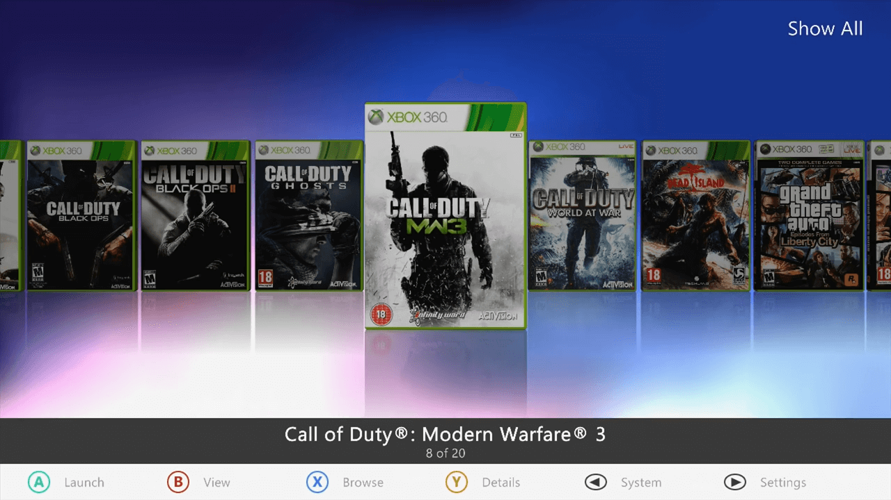
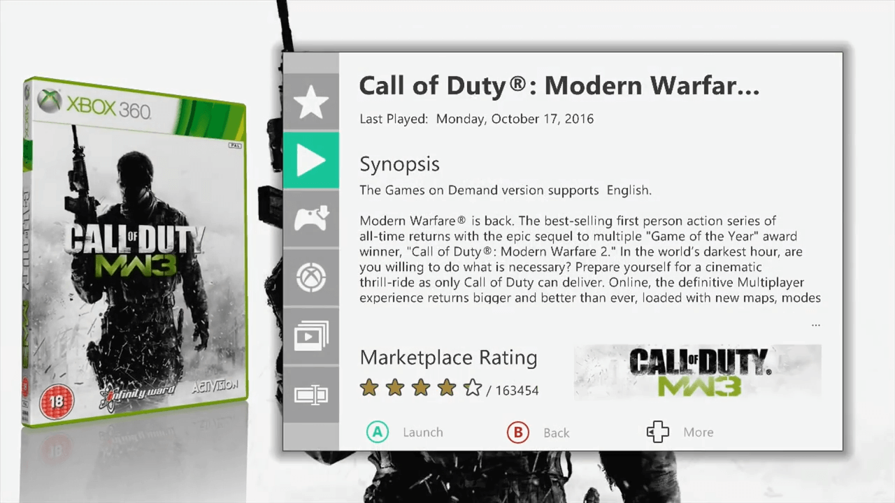

# Aurora

{: style="width: 49%; height: auto"}
{: style="width: 49%; height: auto"}

## What Is It?

Aurora is a custom dashboard focused around the coverflow design of its game launcher. Features include customizable skins, automatic download of game updates and cover art, the ability to organize games into categories, FTP support, integrated system link online play using LiNK, and a plugin system.

It is the most recently updated dashboard, with an official website at XboxUnity.net and an official support forum at RealModScene.com. An FAQ can be found here.

## Features


## Downloads

| File                  | Version | Link                                                                                           |
|-----------------------|:-------:|------------------------------------------------------------------------------------------------|
| `Aurora`              | 0.7b.2  | [Download](http://phoenix.xboxunity.net/downloads/Aurora%200.7b.2%20-%20Release%20Package.rar) |
| `Aurora Asset Editor` |  1.4.2  | [Download](https://github.com/XboxUnity/AuroraAssetEditor)                                     |

!!! Note

    Aurora Asset Editor is not necessary for Aurora installation. It is a graphic editor for Aurora's .asset files. See below for more details.

## Prerequisites

* [XeXMenu](XeXMenu.md)
* [Dashlaunch](Dashlaunch.md)

## Installation

Download the latest Aurora build from XboxUnity.net and extract the files into a new folder named Aurora. Copy this folder to your Xbox 360’s hard drive. Launch the Aurora.xex to start the dashboard, or set it as your default dashboard using DashLaunch.

## File Structure

``` { .yaml .no-copy }
Cache (partition 0)
Content
Homebrew/Apps
    Aurora (Place unzipped Aurora folder here)
        Data
            Logs
        Media
            Assets
            Effects
            Fonts
            Layouts
            Scripts
        Plugins
        Skins (Place aurora skins or .xzp files here)
        User
            Backgrounds
            Icons
            Import
            Scripts
            Trainers
        Aurora.xex
        live.json
        nxeart
    ... other applications
```

## Controls

A: Enter / Confirm / Launch

B: View Settings / Back

X: Browse/Search games / Select multiple files or folders in file manager

Y: Game details / Sync windows’ working directories in file manager

Start: Settings

Back: System info / tools

LB/RB: Change content category

LT/RT: Scroll through content (fast)

Left Thumbstick: Scroll through content (slow)

Right Thumbstick: Peek left/right

DPAD: Move left/right

## Settings


## Plugins


## Skins


---

## Aurora Asset Editor

### What is it?