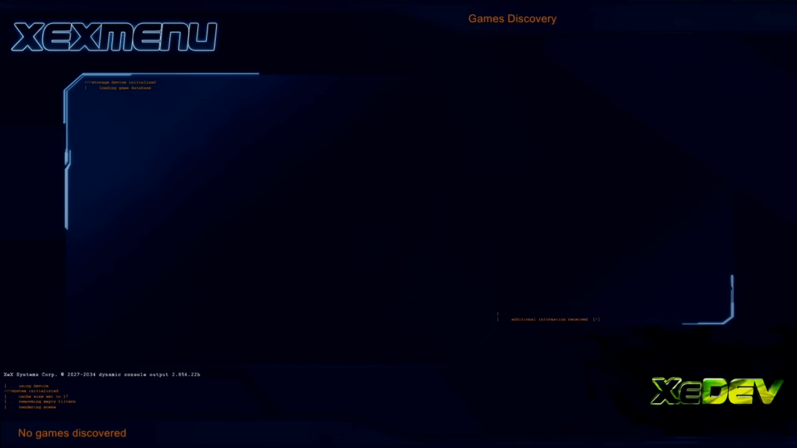

# XeXMenu

{: style="width: 49%; height: auto"}
{: style="width: 49%; height: auto"}

## What Is It?

XeXMenu is a dashboard for the Xbox 360. It is often recommended in JTAG/RGH tutorials as the first dashboard to be installed as it has an installer that shows up under the Games library in the official dash. However, it is limited in function compared to more feature rich dashboards such as Freestyle Dash or Aurora.

## Download

| File         | Version | Link                                                                                                                           |
|--------------|:-------:|--------------------------------------------------------------------------------------------------------------------------------|
| `XeXMenu`    |   1.2   | [Download](https://mega.nz/#!9AlUmDZK!oykniipcx80kvuRxLaqY8NtPMJYKHW1ZYpqYfcAZsLA)                                             |

## Installation

1. Plug a flash drive into your Xbox 360 and navigate to Console Settings > Storage. Select the flash drive and allow it to format the flash drive as a system drive.
2. Extract the CODE9999 folder from the XeXMenu 1.2 rar to your Desktop.
3. Make sure you have hidden folders enabled.
    * Go into File Explorer under View on top, check mark Hidden Items.
4. Plug the flash drive into your PC. Open the Content folder, select "New Folder", and name it 0000000000000000 (16 zeroes). Open the new folder, then drag the CODE9999 folder into it.
5. Safely eject your flash drive and plug it into your Xbox 360. Navigate to the Demos section of your dashboard, and it should list XeXMenu there. Select it to launch it.
    * You can install XeXMenu to your hard drive by going to Console Settings > Storage, and copying it from your flash drive to the hard drive.

## Controls

Back: Visual control list

Start: Launch selection

LB/RB: Change menu

DPAD Left/Right: Change directory

Y: Rescan devices / file context menu

A: Launch selection

B: Back (in file manager)