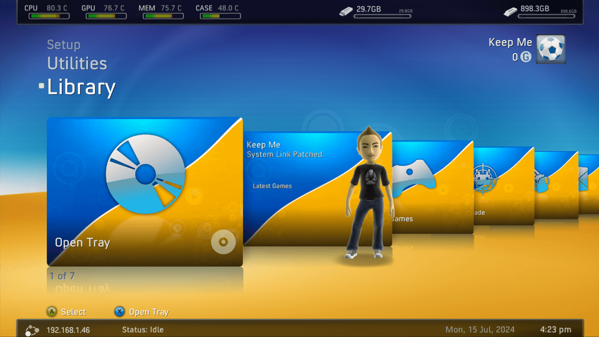
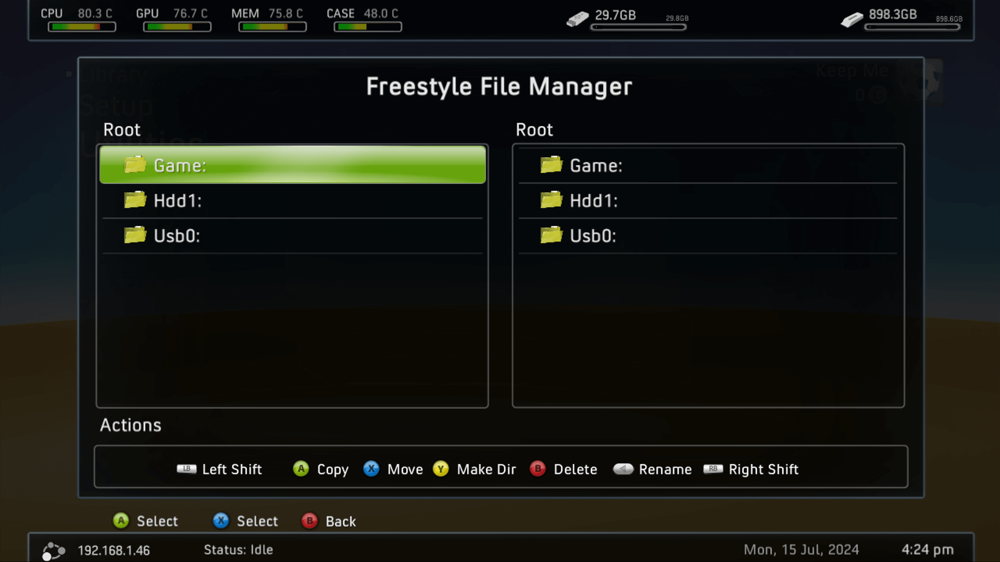

# FreeStyle Dash

{: style="width: 49%; height: auto"}
{: style="width: 49%; height: auto"}

## What Is It?

Freestyle Dash (known as FSD or F3) is a highly customizable replacement dashboard created by Team FSD. Features include the ability to scan, categorize, and download cover art for your Xbox 360, XBLA, and original Xbox games; the ability to launch homebrew apps and tools; a full skinning suite to make your dashboard look and feel how you want; and the ability to set fan settings.

## Features

* Console Temperature Display
* DVD Extract
* Fan Speed Calibration
* File Manager
* FTP Support
* Kinect Support
* Skin Customization
* Weather

## Download

| File                                          | Version | Link                                                                             |
|-----------------------------------------------|:-------:|----------------------------------------------------------------------------------|
| `FreeStyle Dash`                              | 3.0.775 | [Download](https://consolemods.org/wiki/images/7/76/TeamFSD.Freestyle3.0.775.7z) |
| `FreeStyle Dash (Unofficial Patched Version)` |    -    | [Download](https://consolemods.org/wiki/images/a/a0/Fsd3.zip)                    |

## Prerequisites

* [XeXMenu](../xexmenu.md)
* [Dashlaunch](../dashlaunch)

## Installation

Download the latest FSD build from the link above and extract the files into a new folder named FSD. Copy this folder to Homebrew/Apps on your Xbox 360's HDD. Launch the default.xex to start the dashboard, or set it as your default dashboard using DashLaunch.

## File Structure

``` { .yaml .no-copy }
Cache (partition 0)
Content
Emulators
Homebrew/Apps
    FSD (Place unzipped FSD folder here)
        Data
        Media
        Skins
        Database.xmplr
        default.xex
        live.json
        Nuildentity.bin.be
        nuisp1033
        nxeart
    ... other applications
```

## Controls

A: Enter/Confirm/Launch

B: Back (in file manager)

X: Open tray / Sign out

Start: Launch game

Back: Shows the weather (no longer working)

LB/RB: Move left/right one tile. Shows favorites in game category

LT/RT: Move up/down one row.

DPAD: Move left/right one tile or up and down a row

## Settings


## Skins

Custom FSD Skins can be found [Here](https://www.realmodscene.com/index.php?/forum/39-skins/&sortby=views&sortdirection=desc)

## FAQ