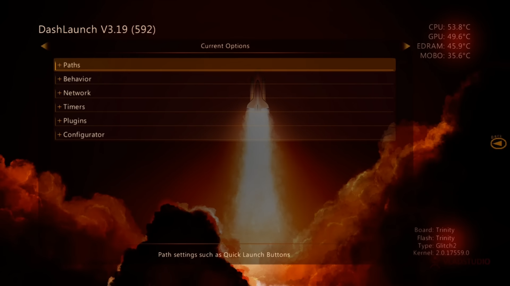
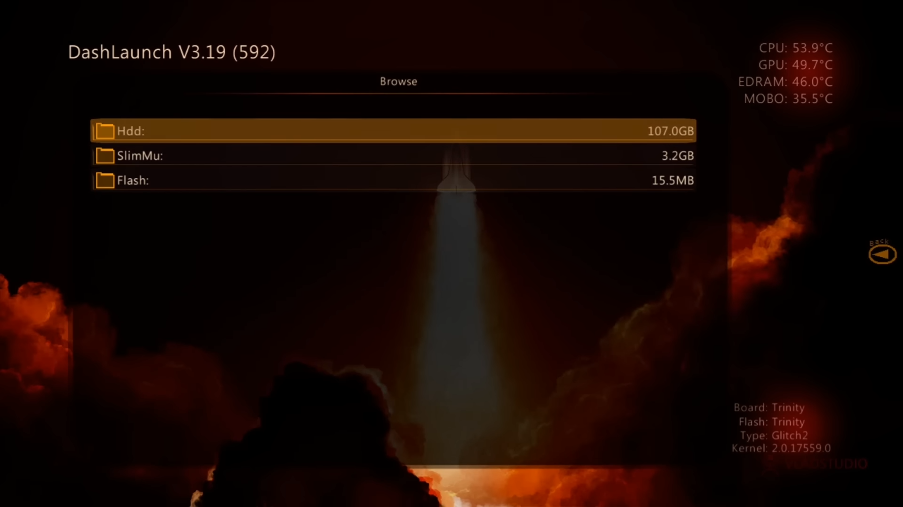

# Dashlaunch

{: style="width: 49%; height: auto"}
{: style="width: 49%; height: auto"}

## What Is It?

Dashlaunch is a custom dashboard, usually used as a tool for tweaking deep system settings. The most common usage for DashLaunch is to set a custom dashboard to be the default one on system startup, and to manage target fan settings, and install plugins. Keep in mind that you must save your changes if you make any modifications by going to the "Save \ Load launch.ini" menu and pressing X on HDD.

## Features

## Download

| File         | Version | Link                                                                                            |
|--------------|:-------:|-------------------------------------------------------------------------------------------------|
| `Dashlaunch` |  3.21   | [Download](https://drive.google.com/file/d/1O-IkxIrocMc2sk3mBbKnA7gJSWWWqod0/view?usp=sharing)  |

## Installation

1. Unpack the zip file included in the download link above to your preferred flash drive
2. Load up XeXMenu and view your flash drive with the above folder inside
3. Press Y then press A on Copy to copy the folder
4. Press X then press A on your HDD
5. Press Y then press A on Create to create a new folder
6. Name the new folder "Homebrew"
7. Afterwards press A on your new Homebrew folder
8. Once inside press Y then press A on Paste to move the previously copied DashLaunch folder

## File Structure

``` { .yaml .no-copy }
Cache (partition 0)
Content
Homebrew/Apps
    Dashlaunch (Place unzipped Dashlaunch folder here)
        default.xex
    ... other applications
```

## Controls

Back: Display controls

B: Quit back to main dashboard

Y: Clear path (if hovering on path setting)

LB/RB: Change menu

LT/RT: Jump to top or bottom of current page view.

DPAD Up/Down: Move up or down

## Settings

### Paths

```
dumpfile: Location to save a crash dump file if your system crashes. It's recommended to set this so that you can troubleshoot your system in the future.
Default: Path to the XEX (usually a dashboard) you want to launch automatically at startup. If nothing set, it will boot the original dash.
(buttons): Path to the XEX you want to launch automatically at startup or when holding the listed button. If nothing set, it won't do anything. RB will always go to the default dashboard.
configapp: Path to the XEX you want to launch when you select System Settings from the miniblades. Nosysexit must be disabled under Behavior.
Guide: Path to the XEX you want to launch when you turn on the console with the guide button.
Power: Path to the XEX you want to launch when you turn on the console with the power button.
Fakeanim: Replaces the boot animation with a custom one. This animation plays before any other of the above options are processed.
```

### Behavior

```
contpatch [enabled]: When enabled, DLC and addons will work without proper licensing.
xblapatch [enabled]: When enabled, XBLA games will boot without proper licensing.
licpatch [enabled]: When enabled, extracted XBLA games will boot without proper licensing.
nxemini [enabled]: When enabled, pressing Y while the miniblades menu is open will launch whatever is set in the Default path option.
dvdexitdash [disabled]: When enabled, pressing Eject will return you to the official dash.
xblaexitdash [disabled]: When enabled, exiting an XBLA game through its menu will return you to the official dash.
nosysexit [disabled]: When enabled, System Settings in the miniblades will launch what is set in the configapp path. If nothing is set, System Settings will do nothing.
nohud [disabled]: When enabled, the miniblades option will not pop up when you press the Guide button.
nohealth [enabled]: When enabled, the Kinect health video at the start of Kinect games will not be shown.
noobe [enabled]: When enabled, prevents dash locale setup screen from showing when dash starts.
autoswap [disabled]: When enabled, DashLaunch will perform automatic disc swapping for multi-disc games. Do not enable this if using FSD or swap.xex.
regionspoof [enabled]: When enabled, holding RB while launching a game will cause the region to be spoofed.
region [default]: Region to be spoofed to when regionspoof is enabled. 0x7FFF (DEVKIT/ALL) is enabled by default.
autoshut [enabled]: When enabled, holding the Guide button will automatically highlight "Turn Off Console" instead of Cancel.
autooff [disabled]: When enabled, automatically shuts off the console when the Guide button is held. Automatically overrides autoshut.
shuttemps [disabled]: When enabled, if you hold the Guide button, the temperatures captured at that moment will be displayed on the shutdown scren. This disables autooff.
devprof [enabled]: When enabled, profiles from a devkit will not appear as corrupt.
fatalreboot [disabled]: When enabled, console will hard reboot if it crashes. Recommended to be disabled in case there is a ROL error code.
fatalfreeze [disabled]: When enabled, console will freeze if it crashes. Disables fatalreboot.
safereboot [disabled]: When enabled, console will soft reboot on fatal crashes. Do not use on JTAG, as it will show an E79 error unless you used the transistor method for the JTAG install.
exchandler [enabled]: When enabled, non-fatal crashes will exit instead of crashing the console.
debugout [enabled]: When enabled, debug messages are sent to UART.
passlaunch [disabled]: When enabled, DashLaunch will not delete your recent played icons.
noupdater [enabled]: When enabled, your console will look for system updates named $$ystemUpdate instead of $SystemUpdate. This prevents accidental updates, as you would have to rename the folder yourself to apply an update.
remotenxe [disabled]: When enabled, powering on the console with an IR remote will go to the official dash.
```

### Network

```
pingpatch:
signnotice: 
liveblock:
livestrong:
xhttp:
nonetstore:
devlink:
sockpatch:
fakelive:
autofake:
autocont:
autofake#:
```

### Timers

```
hddtimer:
hddalive: 
temptime:
tempport:
tempbcast:
```

### Plugins

### Configurator

```
ftpserve:
ftpport: 
updserve:
calaunch:
fahrenheit:
```