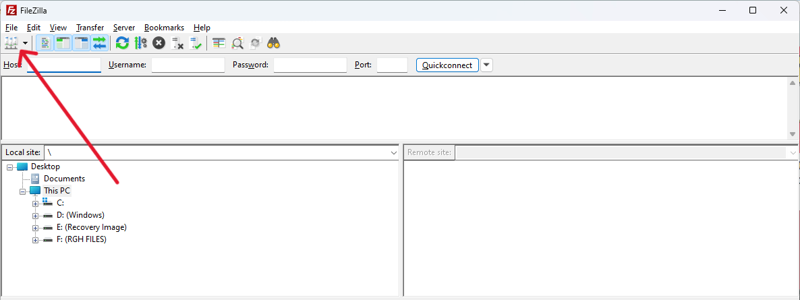
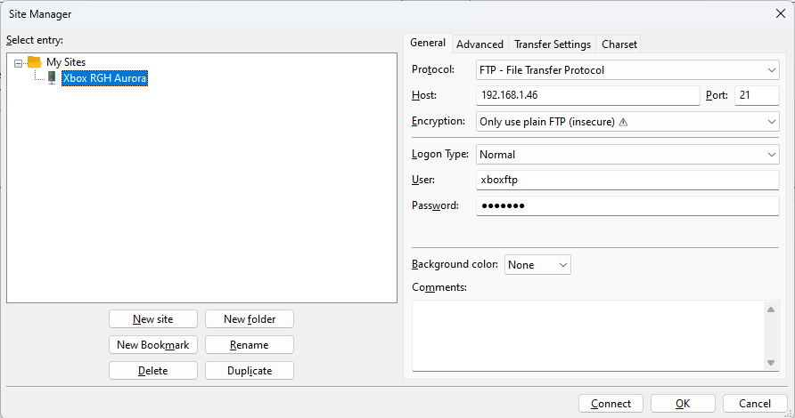

# Setting Up FTP Support with Aurora

## Downloads

| File             | Link                                                                                                    |
|------------------|---------------------------------------------------------------------------------------------------------|
| `FileZilla`      | [Download](https://filezilla-project.org/)                                                              |
| `GODspeed`       | [Download](https://github.com/mercenaryntx/godspeed)                                                    |
| `xbdm.xex`       | [Download](https://drive.google.com/file/d/1IdOgXwYTeTSA5Q00no8e6kQVqNvP8Ype/view?usp=sharing)          | 
| `Xbox SDK`       | [Download](https://www.mediafire.com/file/l9786i9endh5w5e/XBOX360+SDK+21256.3.exe)                      |

!!! Note

    You can use any FTP program whether that be FileZilla, GODspeed, or Xbox 360 Neighborhood. For the purposes of this 
    guide we will be using FileZilla as it is the most updated FTP program. 

## Prerequisites

You will need the IP Address of your Xbox 360. This can be found within Aurora under System.

You will also need the Username, Password, and Port # in order to connect via FileZilla. This can also be found under 
Settings > Modules > FTP Server.

!!! note

    If this is your first time messing with FTP in Aurora the default username and password will be `xboxftp` and the 
    Port # will be `21`.

## Setup

1. Download, install, and open FileZilla.
2. Select `Open the Site Manager`   
    {: style="width: 100%; height: auto"}
3. Click `New Site` and name your Xbox however you like. I'll be naming mine based on the dashboard we are currently 
   using `Xbox RGH Aurora`.
4. Adjust the General settings accordingly.
    * Host: `Your IP Address`
    * Port: `21`
    * Encryption: `Only use plain FTP (insecure)`
    * User: `xboxftp`
    * Password: `xboxftp`
  {: style="width: 100%; height: auto"} 
5. Go to the Transfer Settings tab and adjust the settings accordingly.
    * Limit number of simultaneous connections: `Enabled`
   {: style="width: 100%; height: auto"}
6. You should now be able to click `Connect` and be immediately connected to your Xbox through Aurora.